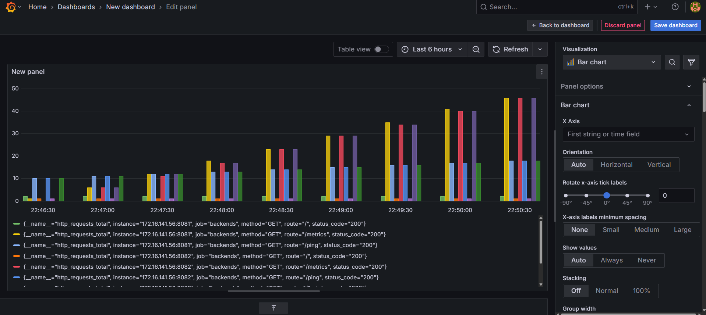
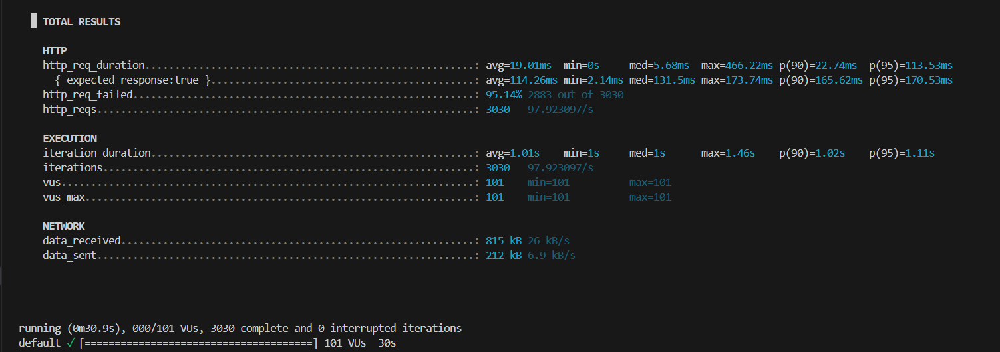

# NeuraBalancer: Intelligent Load Balancer with Prometheus + Grafana Monitoring

This project implements a self-healing, energy-aware, multi-cloud-ready load balancer with real-time monitoring (Prometheus + Grafana) and benchmarking (K6).

---

## 🔧 Features

- ⚙️ Intelligent traffic routing
- 🚦 Health checks and fault tolerance
- 🌍 Multi-cloud support (AWS, GCP, Azure)
- 📈 Real-time metrics via Prometheus + Grafana
- 🧪 Load testing using K6
- 🐳 Docker Compose-based setup

---


## 🚀 How to Run the Project

### 1. Clone the Repository

```bash
git clone https://github.com/mkc13/Load-Balancer.git
cd Load-Balancer
```

### 2. Start All Services with Docker

```bash
docker-compose up --build
```

This will run the following containers:

- `load-balancer`: Intelligent load balancer (port 8080)
- `backend-api`: Admin API (port 3000)
- `redis`, `postgres`, `prometheus`, `grafana`

### 3. Access Services

| Service         | URL                          |
|----------------|-------------------------------|
| Load Balancer   | http://localhost:8080         |
| Admin API       | http://localhost:3000         |
| Grafana         | http://localhost:3000         |
| Prometheus      | http://localhost:9091         |

---

## 🔐 Grafana Login

| Username | Password |
|----------|----------|
| admin    | admin    |

Change password after login.

---

## 📊 Viewing Metrics in Grafana

1. Visit `http://localhost:3000`
2. Login (admin/admin)
3. Select the "Load Balancer Dashboard"
4. View:
   - Request latency
   - Response status codes
   - Route-wise request flow

---

## 🧪 Load Testing with K6

### Run a test:

```bash
k6 run test-load.js
```

You can modify `test-load.js` to increase VUs, duration, or endpoints.

---

## 📈 Prometheus Metrics

Check metrics at:

```bash
http://localhost:9091
```

Use queries like:

- `http_requests_total`
- `load_balancer_latency_seconds`

---

## 🔍 Monitoring Load Balancer Health

Health checks are done every 5 seconds:

- Dead server = marked unhealthy
- Traffic is routed around it

---

## 📚 Methodology Summary

1. **Metrics Collection** via Prometheus
2. **Routing Decision** based on real-time stats and rules
3. **Performance Evaluation** using Grafana/K6
